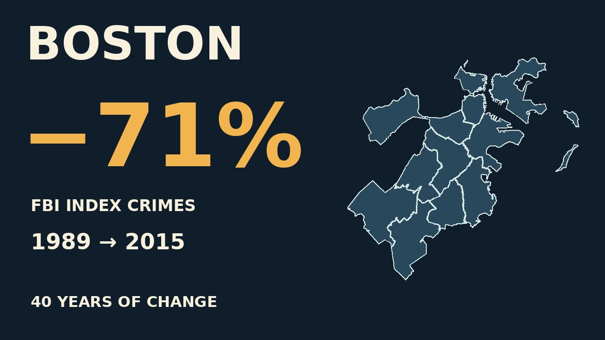
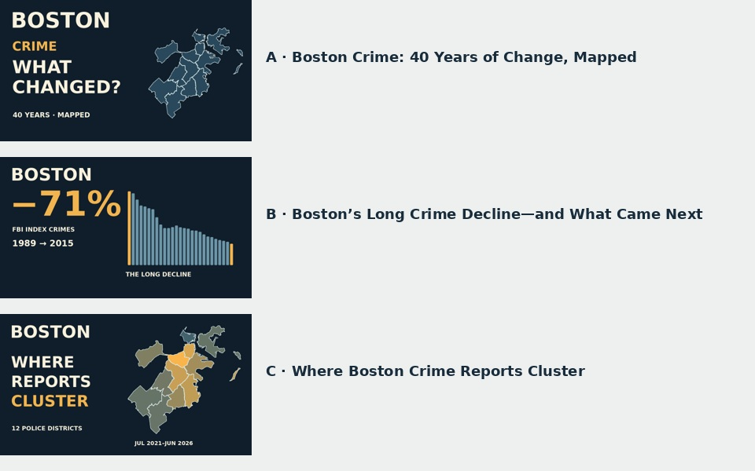

# Boston title and thumbnail review

Selected starting title: **Boston Crime: 40 Years of Change, Mapped**.
Selected thumbnail: **selected-map-number.jpg**, also copied to `../thumbnail.jpg`.
It combines the actual Boston district outline with the verified71% decline,
retaining the exact FBI index-crime measure and1989–2015 period. The neutral
map identifies the place; it does not imply a district-level historical decline.

The original A/B/C candidates remain below as alternatives.
It names the city and topic, promises a bounded historical view, and matches the
film’s shift from annual histogram to active district map. Its question is open
without inventing a cause or a safety ranking. This is an editorial recommendation,
not a measured click-through or retention result.

| Pair | Title | Visual promise |
| --- | --- | --- |
| A | Boston Crime: 40 Years of Change, Mapped | What changed? An actual Boston district outline anchors the story. |
| B | Boston’s Long Crime Decline—and What Came Next | The verified 71% FBI index-crime decline, explicitly 1989–2015, with actual annual bars. |
| C | Where Boston Crime Reports Cluster | The five-year district distribution, using actual boundaries and report counts. |

A covers the full film; B emphasizes its opening payoff; C emphasizes its second
half. None claims that raw totals measure individual danger. These are three
alternatives for review, not an active YouTube experiment. Candidate JPGs are
1280×720. The review sheet displays each at 320×180 for small-size inspection.

Reproduce with `python3 pipeline/episodes/boston-packaging.py` (Python 3, Pillow,
DejaVu Sans fonts). Source boundaries/counts come from the same frozen normalized
Boston dataset as the film. The complete proposed description and chapters are
in `../youtube.json`. Confirm the main-branch recipe link resolves after merge
before a release. Preserve the chosen title/thumbnail hashes with the release.

Thumbnail choice is delegated to the producer; iterate from actual post-release analytics rather than requesting a taste judgment for every alternative. Preserve change dates and comparison conditions.
